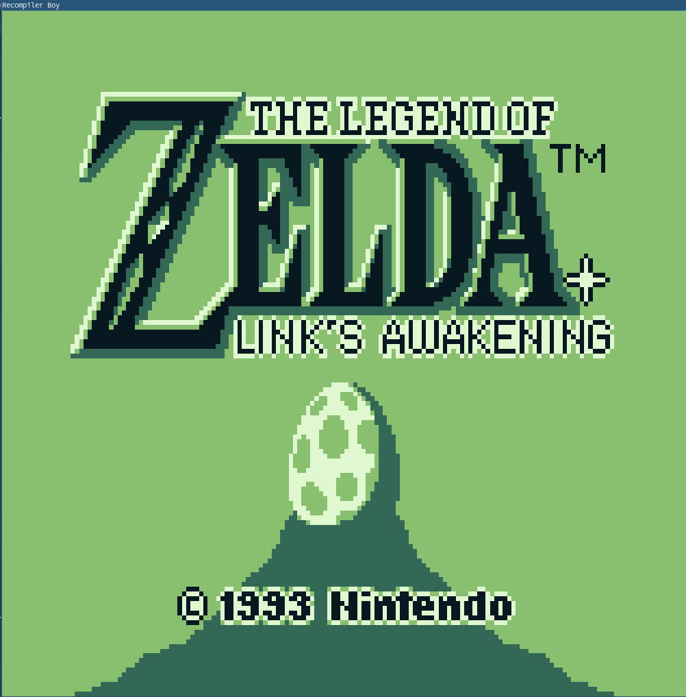
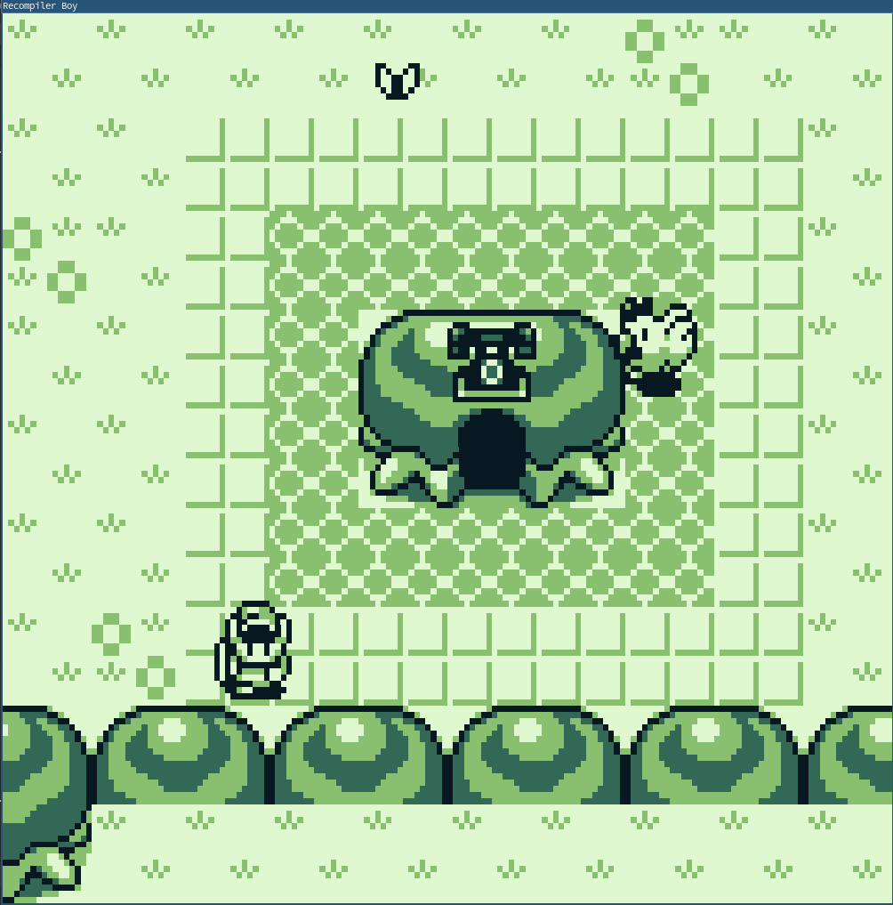
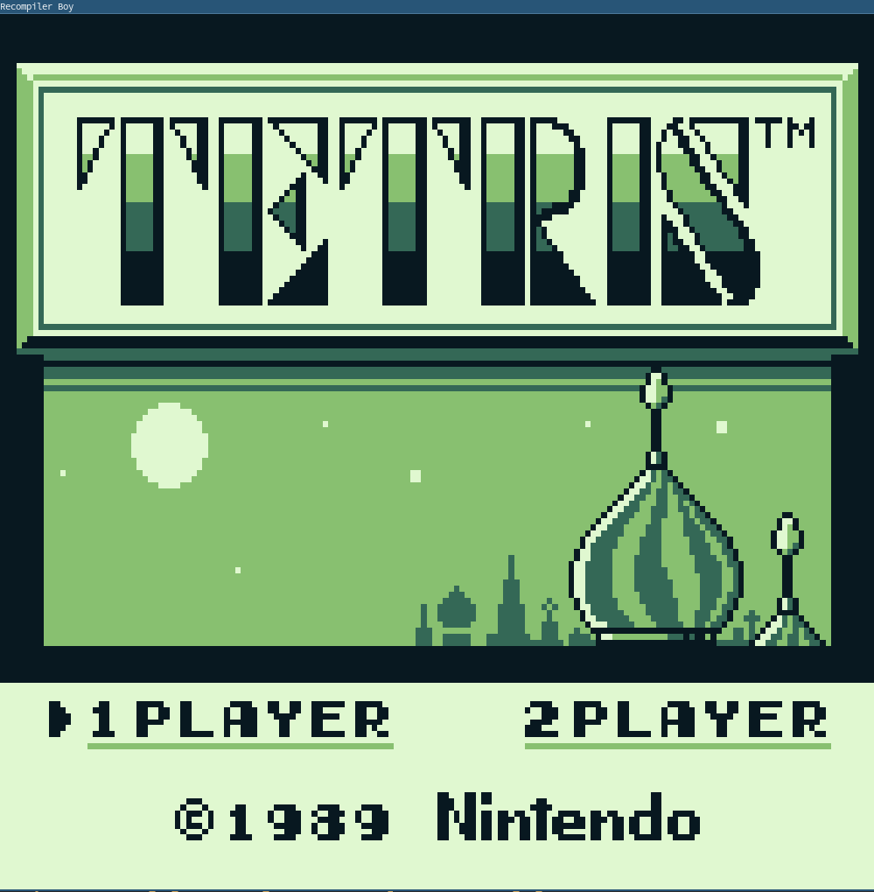
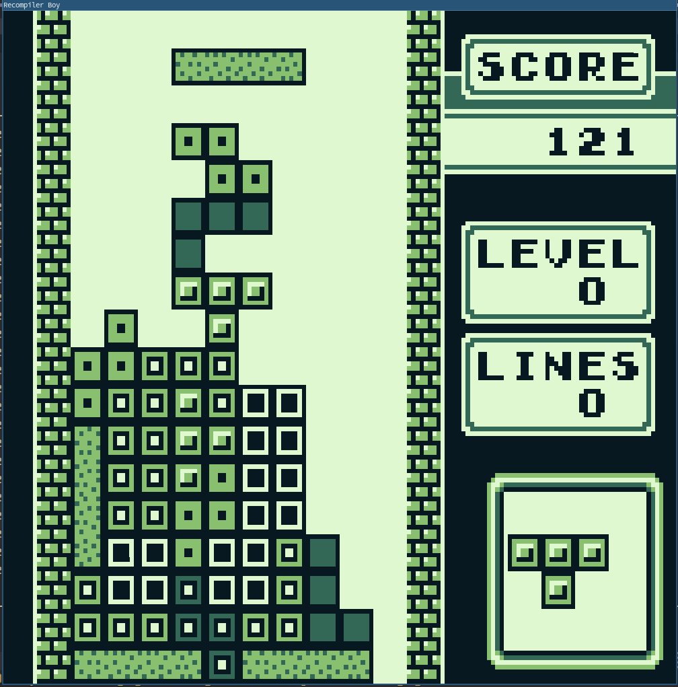
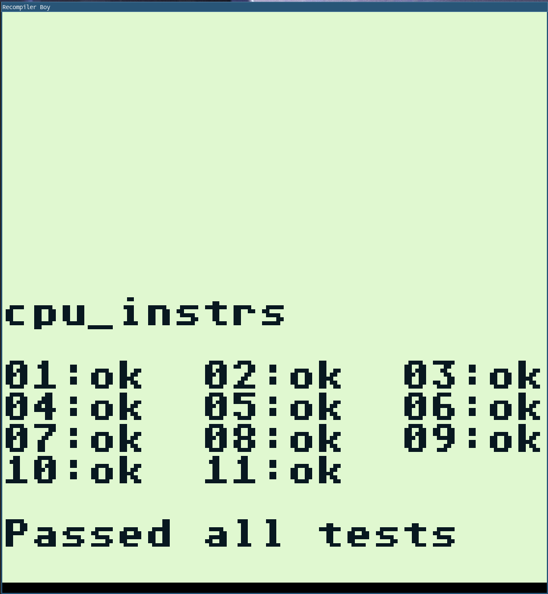
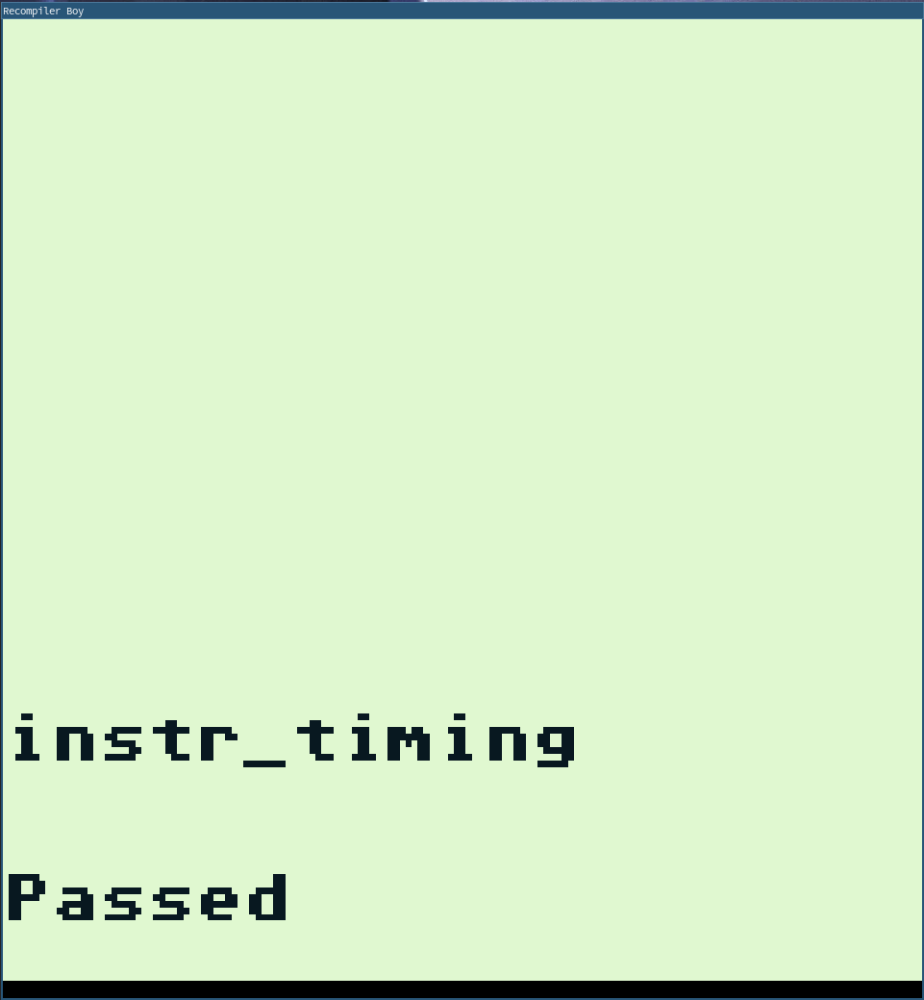

# Recompiler_Boy!
A Gameboy emulator written in C++ to explore dynamic recompilation techniques. Features an accurate interpreter, 
a WIP cached interpreter that translates the Gameboy's Sharp LR35902 ISA to x64, 
and (fairly) accurate PPU emulation. Most games that have their MBC implemented are fully 
playable (see below).

## Features
- WIP Cached interpreter
- Passable emulation of most titles
- Some debug output and logging capabilities are available
 
## Screenshots

Title | In-game
:-------------------------:|:-------------------------:
 | 
 | 

# Tests
These tests have been passed using the interpreter cpu backend.

### [Blaarg's Test Roms](https://github.com/retrio/gb-test-roms)
cpu_instrs | instr_timing
:-------------------------:|:-------------------------:
 | 

### [Acid2 PPU Test Rom](https://github.com/mattcurrie/dmg-acid2)
dmg-acid2 |
:-------------------------:

## TODO
- Add SPU
- CGB support

# Compilation and Usage

This project has only been tested on Linux. To compile, simply run `./run.sh`.

# Project Write Up

This is a mini blog about this project, how emulation works, and how the different challenges that
need to be faced in order to write a cached interpreter/dynamic recompiler. 

# Resources used

#### [Pandocs](https://gbdev.io/pandocs/)
#### [Game Boy: Complete Technical Reference](https://gekkio.fi/files/gb-docs/gbctr.pdf)
#### [SM83 Opcode Decodings](https://cdn.discordapp.com/attachments/465586075830845475/742438340078469150/SM83_decoding.pdf)
